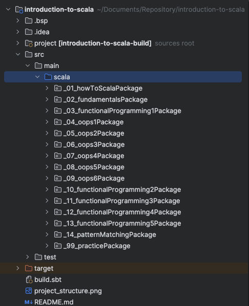

# **INTRODUCTION TO SCALA**
This repository attempts to cover the basic topics of Scala.

**Disclaimer:** It is my first attempt at capturing the basics of a Language.
I have tried my best to verify all the items mentioned.
In the event of something is not up to scratch, 
please feel free to let me know or raise a Pull request. Thank you.

### Pre-requisites
Below are the items required to be setup in Local environment:
1. IntelliJ is the most widely used IDE for Scala development. It can be downloaded from: https://www.jetbrains.com/idea/download/?fromIDE=&section=mac.
2. Scala is based upon Java and hence requires Java to be installed for it to function. Java has a variety of versions available. Suggested stable version is v1.8 and can be downloaded from: https://www.oracle.com/java/technologies/downloads/#java8. Note: IntelliJ allows you to download a Java SDK while creation of a Project if it is not locally installed.
3. Scala can be installed in the system or users have the option of not installing Scala locally in the system and instead defining the version of Scala to be used for the Project build (preferably Scala 3) and define the version of sbt (Scala native build tool) along with it.

### How to read
Topics of similar nature are grouped together in Packages.
Each topic is in the form of Objects under respective packages.
At the beginning of each Topic there is a small commented description about the topic.
Information mentioned in such commented sections can help in understanding the concepts and code.

### Structure of Repository

### Order of Contents:
* How to Run
* Fundamentals of Scala
  * Variables
  * Values
  * Primitive Data Types
  * Type Conversion
  * Expression
  * Code Block
  * String Operations
  * String Interpolation
* Functional Programming 1
  * Introduction
  * Default Argument
  * Argument Call Types
* Object Oriented Programming 1
  * Class & Instances
  * Constructor
  * Attribute Overload
  * Constructor Overload
  * Syntactic Sugar
  * Object
* Practice
  * Class Parameter Update
* Object Oriented Programming 2
  * Inheritance
  * Single Parent Inheritance
  * Public vs Protected vs Private Class Attributes
  * Super Constructor & Auxiliary Constructor
  * Polymorphism
  * Preventing Overloading
  * Sealed Inheritance
  * Abstract Class
  * Anonymous Class
  * Traits
* Object Oriented Programming 3
  * Generics
  * Variances
    * Invariant
    * Covariant 
    * Contravariant
  * Bounded Types
* Object Oriented Programming 4
  * Case Class
  * Enumerator
* Object Oriented Programming 5
  * Exception Handling
  * Custom Exceptions
* Object Oriented Programming 6
  * Import & Package
  * Package Object
* Functional Programming 2
  * Functions Continued
  * Function Types
  * Higher Order Function
  * Currying
  * Anonymous Function / Lambda
* Practice
  * Function Breakdown
  * Higher Order Function Loop
* Functional Programming 3
  * Sequence
  * List
  * Array
  * Vector
  * Tuple
  * Maps
* Functional Programming 4
  * Map
  * Filter
  * FlatMap
  * Multi-Sequence Iteration
  * For Comprehension
* Functional Programming 5
  * Option
  * Handling Failure
* Pattern Matching
  * Switch Case
  * Case Class Attribute
  * Guard Rails
  * Sealed Class (Scenario Coverage)
  * WildCard Usage
  * Map
  * Try-Catch
